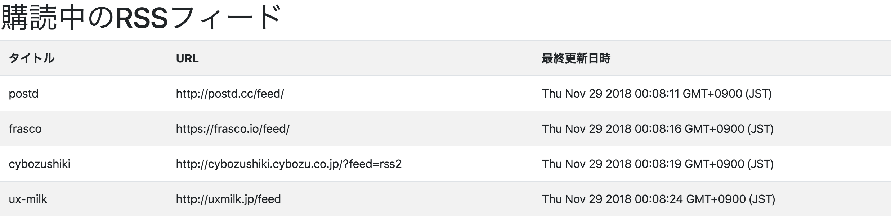

RSS FEED VIEW
====

Overview

[ryoto7ishikawa/RSS-Agent](https://github.com/ryoto7ishikawa/RSS-Agent)の購読中のフィードを表示するためのアプリ

## Description

## Demo

## Requirement

- 開発
    - nodejs
- 本番
    - Google Apps Script

## Usage
後術のURLにアクセス．

## Install
GASのプロジェクトを作成し，destに含まれるファイルをすべてアップロードする．

その後，webアプリケーションとして公開する．

ここで得られるURLにアクセスすれば利用できる．

## Contribution

## Licence

[MIT](https://github.com/tcnksm/tool/blob/master/LICENCE)

## Author

[ryoto7ishikawa](https://github.com/ryoto7ishikawa)
